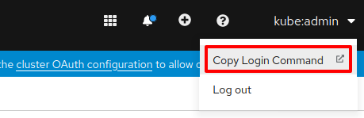

# TriggerMesh Operator


This Kubernetes operator installs TriggerMesh Platform on Openshift clusters.

## Pre-requisites

- [Auth0 Account](https://auth0.com/)
- [Dockerhub Account](https://hub.docker.com/)
- [OpenShift 4 Cluster](https://docs.openshift.com/container-platform/4.4/welcome/index.html) with the following operators installed from the OperatorHub
    + [OpenShift Serverless Operator](https://access.redhat.com/documentation/en-us/openshift_container_platform/4.4/html/serverless_applications/installing-openshift-serverless-1#installing-openshift-serverless)
    + [OpenShift Pipelines Operator](https://docs.openshift.com/container-platform/4.4/pipelines/installing-pipelines.html)

## Assumptions

This document assumes the following:

- OpenShift cluster uses the public hosted zone `clusters.openshiftcorp.com`
- OpenShift cluster is named `triggermesh`

Consequently the Openshift console for your cluster would be accessible at
https://console-openshift-console.apps.triggermesh.clusters.openshiftcorp.com.
Update the URLs according to your setup and configuration.

## Prepare the Cluster

### Kaniko Workaround

The TriggerMesh Platform uses the [Kaniko executor](https://github.com/GoogleContainerTools/kaniko)
for building images. A known [issue](https://github.com/GoogleContainerTools/kaniko/issues/105)
in Kaniko prevents it from being run as a non-root user. To work around this
issue in OpenShift you need to add the `anyuid` security permission for
authenticated users.

Find the command to login to your cluster by following the link as shown in
the screenshot below and login to your OpenShift cluster using the `oc` CLI.



Next to add the `anyuid` security permission execute the following command:

```bash
oc adm policy add-scc-to-group anyuid system:authenticated
```

### Enable Knative-serving API

The The Knative-serving API needs to be instantiated in the `knative-serving`
namespace. Create a new project named `knative-serving` in the OpenShift
console. Follow the path **Operators > Installed Operators > OpenShift Serverless Operator > Knative Serving > Create Knative Serving**
and instantiate the Knative Serving API in the `knative-serving` project.

## Configure Auth0 Applications

TriggerMesh uses [Auth0](https://auth0.com) for authenticating users. Follow
the steps in the [Auth0 setup guide](./docs/auth0_setup_guide.md) to complete
the Auth0 setup.

The guide walks you through the process of creating two Auth0 applications,
one for the frontend and the other for the backend. The application
credentials for the applications need to be specified by deploying the
TriggerMesh Platform, so note down the __Client ID__ and __Client Secret__ of
the applications.

## Install TriggerMesh Platform

### Create `triggermesh` project

From the OpenShift console, create a project named `triggermesh` which will be used for deploying TriggerMesh.

### Setup Docker credentials

Since user functions are stored as Docker container images, having an image
registry reachable from the backend pod is one of the prerequesites. By default,
TriggerMesh backend is looks for a local unauthenticated registry at
`knative.registry.svc.cluster.local` but it can be changed by setting backend
env variables:

- `REGISTRY_HOST` - docker registry domain, eg. `index.docker.io`
- `REGISTRY_SECRET_NAME` - if specified, use this K8s secret to authenticate in registry

The registry secret must be of type `docker-registry`.

Please beware the provided registry secret will be copied to all user
namespaces and eventually can be accessed by the user. Creating a dedicated
profile and/or using an access token instead of your password may be a good idea.

Create a pull secret named `docker-registry` in the `triggermesh` namespace
using the following command:

```
oc create secret -n triggermesh docker-registry "docker-registry" \
  --docker-username <DOCKERHUB_USERNAME> \
  --docker-password <DOCKERHUB_PASSWORD> \
  --docker-server docker.io
```

**Remember to update `<DOCKERHUB_USERNAME>` and `<DOCKERHUB_PASSWORD>` in the
placeholders above with the correct values**

### Install the TriggerMesh Operator

Install the **Operator by TriggerMesh** in the `triggermesh` project from the
OpenShift **OperatorHub**. After a few minutes the TriggerMesh Operator will
appear in the **Installed Operators** section.

### Deploy TriggerMesh

To deploy the TriggerMesh Platform you need to instantiate it using the
TriggerMesh Operator. Follow the path **Operators > Installed Operators >
Operator > Running TriggerMesh instance > Create TriggerMesh** and instantiate
TriggerMesh using the following resource template.

```yaml
apiVersion: app.triggermesh.io/v1alpha1
kind: TriggerMesh
metadata:
  name: triggermesh
spec:
  frontend:
    baseHost: cloud.apps.triggermesh.openshift.openshiftcorp.com
    authDomain: {AUTH0_TENANT_DOMAIN}
    auth0ClientId: {FRONTEND_AUTH0_APP_CLIENT_ID}
    authApiId: {BACKEND_AUTH0_APP_CLIENT_ID}
    route:
      annotations:
        kubernetes.io/tls-acme: "true"
      enabled: true
  backend:
    baseHost: api.apps.triggermesh.openshift.openshiftcorp.com
    auth0_url: https://{AUTH0_TENANT_DOMAIN}
    route:
      enabled: true
      annotations:
        kubernetes.io/tls-acme: "true"
  secrets:
    auth0ClientId: {BACKEND_AUTH0_APP_CLIENT_ID}
    auth0ClientSecret: {BACKEND_AUTH0_APP_CLIENT_SECRET}
```

*Remember to update the `AUTH0_TENANT_DOMAIN`, `FRONTEND_AUTH0_APP_CLIENT_ID`,
`BACKEND_AUTH0_APP_CLIENT_ID` and  `BACKEND_AUTH0_APP_CLIENT_ID` placehoders*
and also the value of the `baseHost` for the `frontend` and `backend`.

Refer to the [sample configuration](https://github.com/triggermesh/operator/blob/master/deploy/crds/app_v1alpha1_triggermesh_cr.yaml)
for reference

Now, follow the OpenShift console path **Networking > Routes > triggermesh-frontend**
and follow the link listed under **Location** to access the TriggerMesh
Platform.

Enjoy TriggerMesh !

### Ingress TLS certificate

TriggerMesh Cloud provides an opportunity to configure [tm](https://github.com/triggermesh/tm)
CLI by downloading configuration file from our dashboard. To generate valid CLI
configuration you need to set a backend's `FRONTEND_TLS_SECRET_NAME` env
variable value to make it point to k8s secret with a frontend ingress TLS
certificate.

If you configure TLS in your cluster, the secret name can be found in the
ingress object specs - `spec.tls.hosts[0].secretName`.

If you didn't configure TLS, default Operator certificate should be stored in
`router-certs-default` secret of `openshift-ingress` namespace. In case when
the namespace with the secret is not the namespace of the backend pod,
`FRONTEND_TLS_SECRET_NAME` value must contain target namespace:
`router-certs-default/openshift-ingress`

## Development

You can build the operator yourself with `operator-sdk`:

```
operator-sdk build gcr.io/triggermesh/operator:0.0.1
docker push gcr.io/triggermesh/operator:0.0.1
```

> Note that our CI builds the operator on every commit, hence
> `gcr.io/triggermesh/operator:latest` is always the latest revision

## Sponsor

This work is made possible by a partnership between TriggerMesh, Inc and
[VSHN, the DevOps Company](https://vshn.ch/), the developers of the Swiss
Container Platform [APPUiO](https://www.appuio.ch/)

## Support

This is heavily **Work In Progress** We would love your feedback on this
Operator so don't hesitate to let us know what is wrong and how we could
improve it, just file an [issue](https://github.com/triggermesh/aktion/issues/new)

## Code of Conduct

This operator is by no means part of [CNCF](https://www.cncf.io/) but we abide
by its [code of conduct](https://github.com/cncf/foundation/blob/master/code-of-conduct.md)
