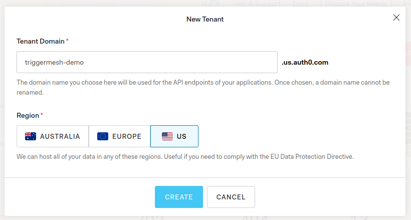
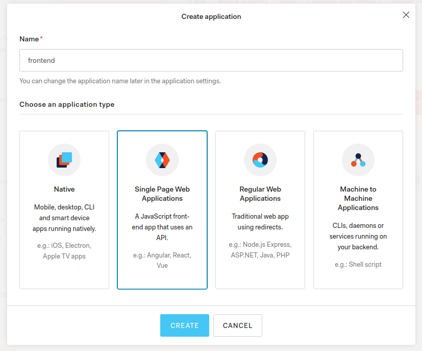
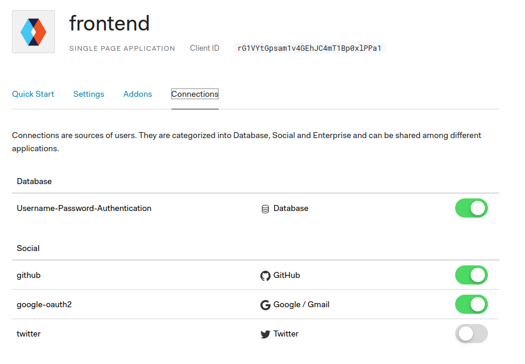
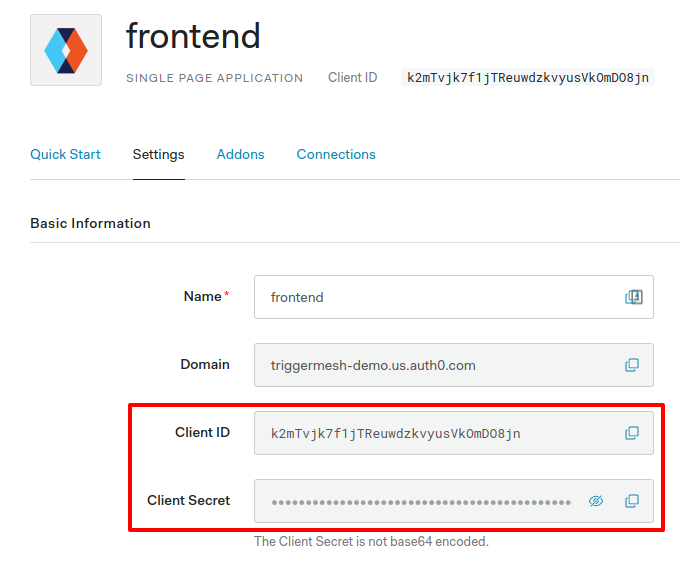
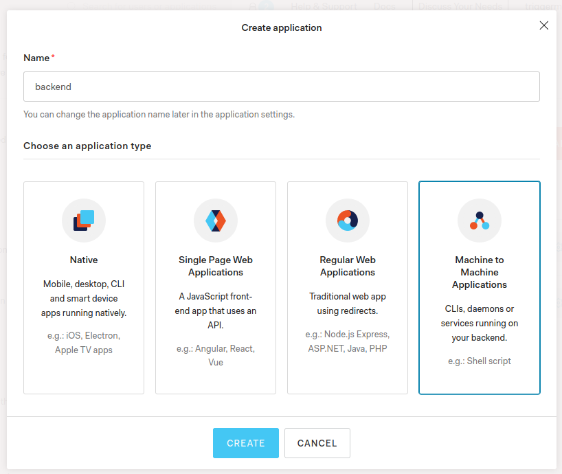
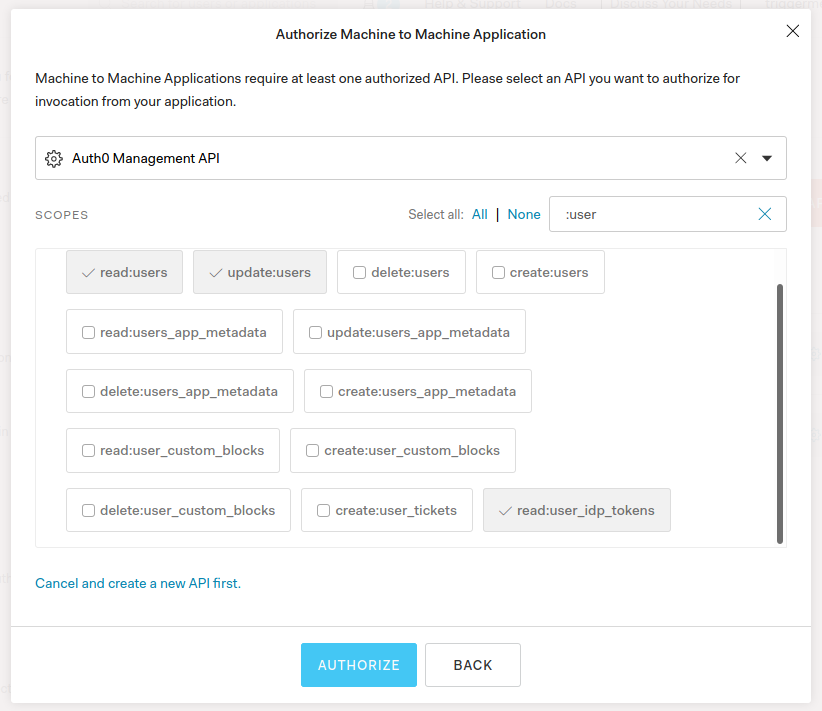
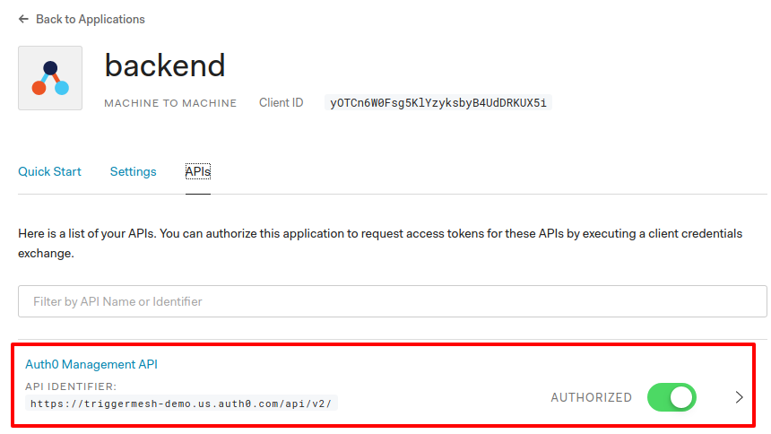
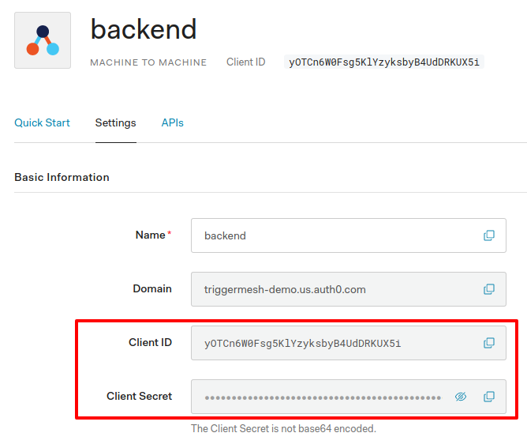

# TriggerMesh Auth0 Setup Guide

The TriggerMesh Platform uses [Auth0](https://auth0.com) for authentication.
Two Auth0 applications need to be created one each for the frontend and backend
components of the TriggerMesh Platform.

This document walks you through the process of setting up the two Auth0
application instances.

## Pre-requisites

- [Auth0 Account](https://auth0.com/)

## Assumptions

This document assumes the following:

- OpenShift cluster uses the public hosted zone `clusters.openshiftcorp.com`
- OpenShift cluster is named `triggermesh`

Consequently, the OpenShift console for your cluster would be accessible at
https://console-openshift-console.apps.triggermesh.clusters.openshiftcorp.com.
Please update the URLs according to your configuration.

## Create a Tenant

Login to your Auth0 account and create a tenant for the TriggerMesh installation
and switch to the new tenant.



To enable user authentication using existing Social accounts (f.e. Github,
Twitter, etc.) visit the **Authentication > Social** page and configure the
required services.

Make a note of the **Tenant Domain**, `triggermesh-demo.us.auth0.com` in the
screenshot above, as it will be used in the TriggerMesh Platform configuration.

## Frontend Application

To create the Auth0 application for the `frontend` visit **Applications >
Create Application** and create a **Single Page Web Applications** with a name
of your choice and click **Create**.




Visit the applications **Settings** tab and update the **Allowed Callback URLs**
with the following configuration:

```
https://cloud.apps.triggermesh.clusters.openshiftcorp.com/build-triggers, https://cloud.apps.triggermesh.clusters.openshiftcorp.com/auth-callback, https://cloud.apps.triggermesh.clusters.openshiftcorp.com/function/create/, https://cloud.apps.triggermesh.clusters.openshiftcorp.com/build-triggers/create/, https://cloud.apps.triggermesh.clusters.openshiftcorp.com/function-triggers/create/
```

and set the values for the **Allowed Logout URLs**, **Allowed Web Origins** and
**Allowed Origins (CORS)** to `https://cloud.apps.triggermesh.clusters.openshiftcorp.com`
and **Save Changes**.

Next, visit the **Connections** tab to enable/disable Social connections as
desired.



Finally make a note of the **Client ID** and **Client Secret** of the
application. These details will be used while configuring the TriggerMesh
Platform. Next, you need to create a Auth0 application for the backend component.



## Backend Application

For the `backend` application visit **Applications > Create Application** and
create a **Machine to Machine Applications** with a name of your choice and
click **Create**.

 


In the next step select **Auth0 Management API** from the drop down list and
enable the following scopes and click **Authorize**:

- `read:users`
- `read:user_idp_tokens`
- `update:users`




Next, ensure the **Auth0 Management API** is enabled in the **APIs** tab



Visit the applications **Settings** tab and update the **Allowed Callback URLs**
with the following configuration:

```
https://cloud.apps.triggermesh.clusters.openshiftcorp.com/build-triggers, https://cloud.apps.triggermesh.clusters.openshiftcorp.com/auth-callback, https://cloud.apps.triggermesh.clusters.openshiftcorp.com/function/create/, https://cloud.apps.triggermesh.clusters.openshiftcorp.com/build-triggers/create/, https://cloud.apps.triggermesh.clusters.openshiftcorp.com/function-triggers/create/
```

Now make a note of the **Client ID** and **Client Secret** of the application.



Congratulations! You have successfully create the Auth0 applications for the
TriggerMesh Platform.

## Next Steps

- [TriggerMesh Operator Installation Guide](../README.md)
